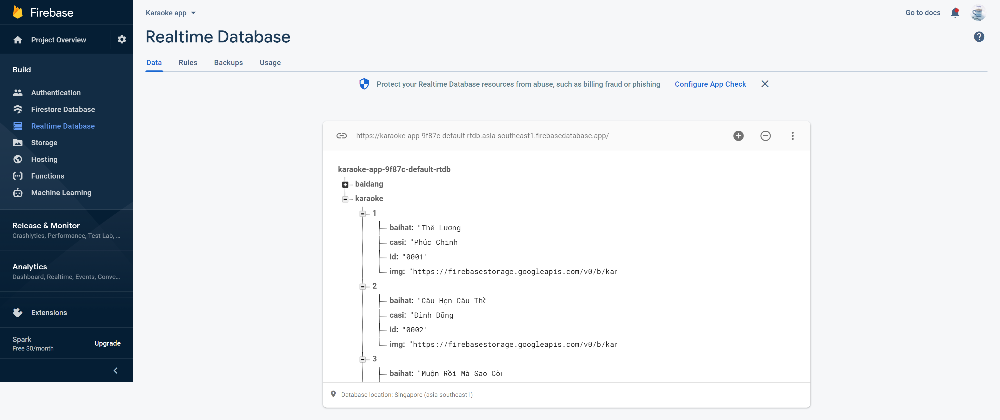

# Project Karaoke Moon
#### Đề tài xây dựng ứng dụng hát Karaoke trên Android(sử dụng Android Studio)

- Link thiết kế giao diện(sử dụng Figma): https://www.figma.com/community/file/1057529373628705343  
- Video Demo: https://youtu.be/-B1Npa0mAQ0  
- Link làm việc nhóm Trello: https://trello.com/b/pogKnJr8/nh%C3%B3m-hkt-android-studio-code

###### *Tương thích với các thiết bị sử dụng **Android 5.0**(API 21) đến **Android 9.0**(API 28)

### Hình Ảnh trong ứng dụng
    

### Firebase Realtime Database & Firebase Storage
##### Firebase Realtime Database: Lưu URL hình ảnh bài hát và thông tin bài hát
  
##### Firebase Firebase Storage: Lưu file nhạc(.mp3), file hình ảnh bài hát và file lời bài hát(.lrc)
   

### Mô hình xây dựng bài hát
  

#### Thành viên tham gia:
- Nguyễn Đăng Trường(Trưởng nhóm)  Liên hệ: nguyendangtruong5070@gmail.com
- Nguyễn Việt Hoàng (Thành Viên)
- Nguyễn Chí Khang (Thành Viên)
